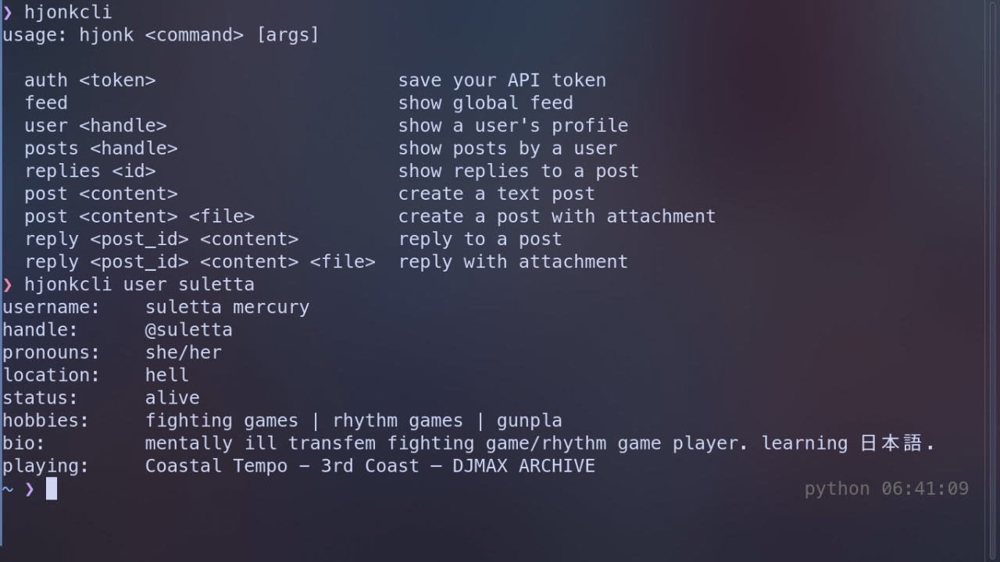

# hjonkcli
read the sidebar bleh



***i do not have a windows version, please use WSL2 if you need windows support***

# installation
dependencies: ```gcc, pkgconf/pkg-config, libcurl, libcjson```
on arch? use the aur
```git clone https://aur.archlinux.org/hjonkcli.git && cd hjonkcli
makepkg -si
```
or your favorite aur helper  
elsewhere? build manually
```git clone https://github.com/asticassiasuletta/hjonkcli && cd hjonkcli
gcc hjonk.c -libcurl -libcjson -o hjonkcli
(sudo) mv hjonkcli /local/usr/bin/hjonkcli
```

# usage
run ```hjonkcli``` for instructions but the tl:dr is
make a new api key
run ```hjonkcli auth YOUR_API_KEY```
profit
